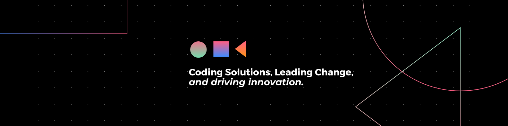

 

# Hi there, I'm Utkarsha Pawar 👋

**MTech in Computer Engineering | Human Resource Management MBA | Developer & Educator**

---

## 📚 About Me
- 🎓 Currently pursuing MTech in **Computer Engineering** at **Veermata Jijabai Technological Institute (VJTI)**, Mumbai
- 🎓 MBA in **Human Resource Management** from **K. P. B. Hinduja College of Management Studies (YCMOU)**, Mumbai
- 💼 Worked as a **Lecturer** and an **Intern**, with experiences in **WebGIS Dashboards**, **Satellite Data Analytics**, and **Educational Content Creation**.

---

## 💻 Experience
- **Aumsat Technologies** (2024) - Intern: Creation of WebGIS Dashboards and Satellite Data Analytics for water resource management.
- **Thakur Polytechnic** (2022) - Lecturer in the Computer Engineering Department.
- **Educba** (2024) - Educational Content Creator for IOT courses.

---

## 🚀 Personal Projects
- **Carbon Emission Analysis for Water Pipelines** (2023): Python-based application analyzing energy consumption and CO2 emissions due to pipeline leakages.  
  **Tech Stack**: Python, Streamlit, Pandas, NumPy, Matplotlib
- **Fitness App** (2022): A mobile app built using React Native to display fitness routines and statistics.  
  **Tech Stack**: React Native, JavaScript, Redux, Expo, REST APIs
- **Attendance Management System** (2022): A Java-based system managing student and teacher attendance with admin and teacher login.  
  **Tech Stack**: Java, MySQL

---

## 🔧 Languages & Tools

                        

---
## 🎓 Certifications & Publications
- **Deep Learning** - Coursera
- **Digital Marketing** - Digital Deepak
- **IEEE Paper Publication** - 2020
- **IJOER Paper Publication** - 2020

---

## 🏆 Achievements
- 2nd Prize, **M-Indicator Hackathon** - Android App Development (2024)
- **Gold Medalist** - Hindi Rashtrabhasha Exam (2012)

---

## 🌱 Positions of Responsibility
- Ambassador & Student Partner, **Internshala** (2019)
- Student Coordinator, **50th Youth Festival** (2017)

---

## 🎤 Leadership & Extracurriculars
- Active participant in workshops, competitions, and festivals.
- Volunteered for an NGO and participated in various cultural activities, including singing and drama.
- Sports enthusiast with experience in basketball, badminton, carrom, and chess.

---

## 🌐 Connect with Me

